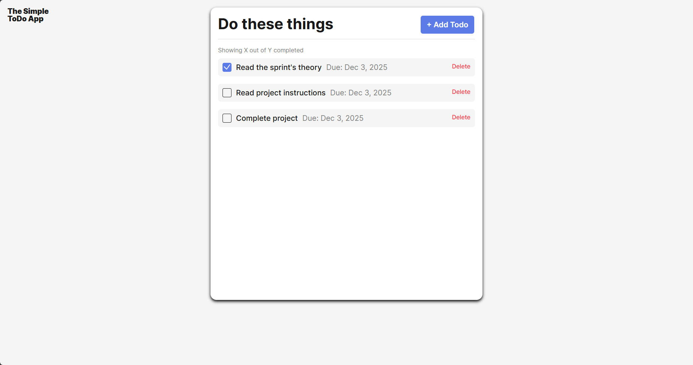
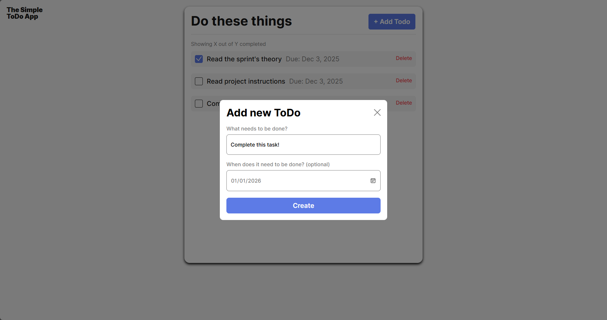

# Project 4: The Simple To-Do App

This to-do app is the 4th (mini) project through [TripleTen](https://tripleten.com/), a simple app for tracking various tasks and deadlines.

This app serves primarily as an intro to refactoring; Cleaning up old code, and organizing it in a smarter way using classes and modular files.

## Images

To-Do rendered within a 1440px display:

## See it for yourself!

You may view the site in action through my [GitHub Pages deployment](https://o-p-e-n-b-a-l-l.github.io/se_project_todo-app/).
